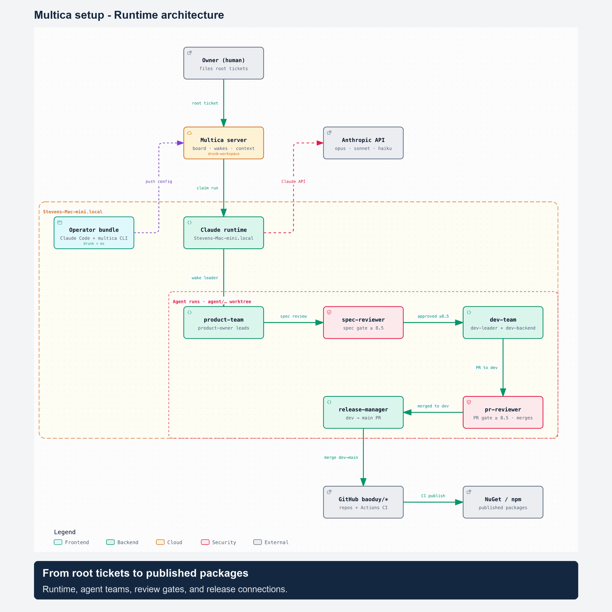
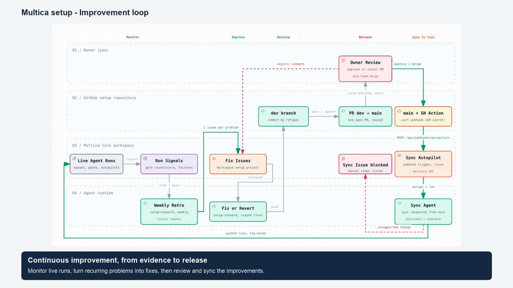
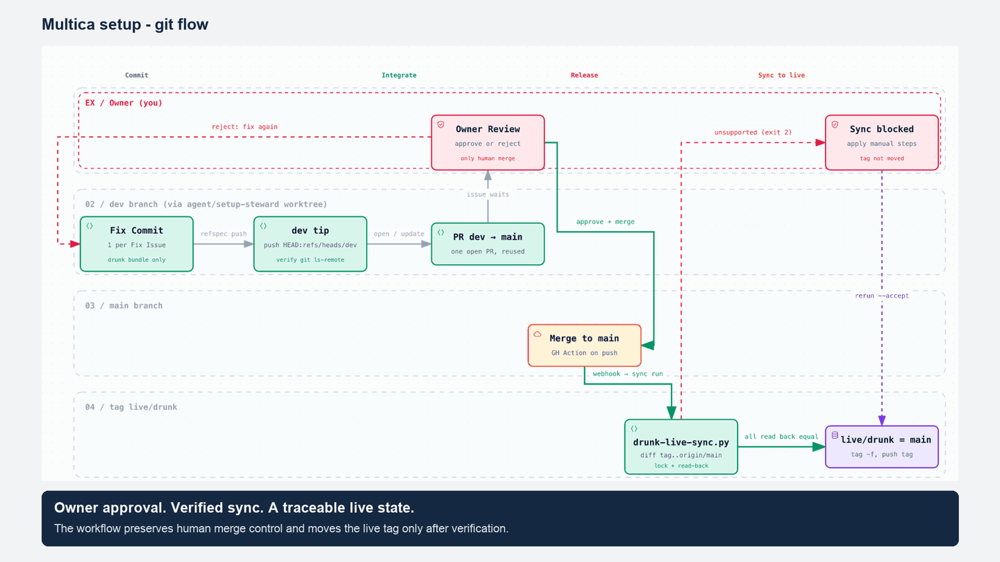

# multica setup — workspace bundles

Local mirrors of live Multica workspaces (`drunk-workspace/`, `mx-workspace/`).
Each bundle holds the workspace's agents, skills, squads, docs/policies, and a
`manifest.json`. Edit locally first, keep the bundle byte-identical to what is
pushed, and always confirm before pushing to a live workspace (see `../CLAUDE.md`).

The drunk bundle improves itself weekly and syncs live when `main` is merged:
see [`docs/drunk-setup-improvement-loop.md`](docs/drunk-setup-improvement-loop.md).

## Diagrams (drunk-workspace)

Rendered with [archify](https://github.com/tt-a1i/archify). Each image links to
its interactive HTML source in `.archify/`.

### Runtime architecture

### Setup improvement loop

### Setup git flow

## Review-gate scoring — design lessons (2026-08)

Learned from auditing `pr-review-gate` and `spec-review-gate`. Apply these to any
future scoring rubric in any workspace:

1. **Per-category weighted deductions dilute repeated findings.** One `important`
   (−2) in a 25%-weight category costs only 0.5 on the final score; a PR could
   carry importants across several categories and still pass. Fix: global hard
   caps on finding *counts*, not just weighted math — e.g. ≥2 open
   `important`/`major` findings anywhere → cap 8.4 (below the 8.5 bar).
2. **"Right thing" must be able to gate.** If spec conformance is a low-weight
   category, a PR solving the wrong problem can still score 9+. Fix: hard cap —
   spec-conformance ≤ 5 or no traceable spec link → 6.9 max.
3. **Every severity referenced must be defined.** `critical` appeared in caps and
   preconditions but not in the severity list, so it could never be assigned.
   Define it (`blocking (critical)` = security-exploitable subtype of blocking)
   or don't reference it.
4. **State cap-vs-floor precedence explicitly.** A fast-path floor (docs-only →
   9.0) and a blocking cap (→ 6.9) can both fire on one PR. Rule: caps beat
   floors, written into the rubric.
5. **Every gate needs explicit deduction math AND calibration anchors.**
   "Score each dimension 1–10" without a severity→points mapping makes scores
   non-reproducible across rework rounds and lets majors slide through. Use the
   same mechanics everywhere: start 10; blocker −4, major −2, minor −0.5
   (max −1.5 from minors); floor 1; caps after weighted sum.
6. **A gate that replaces human approval must be at least as strict as the gates
   downstream of it.** Spec gate was 8.0 while PR gate was 8.5 — but a bad spec
   is costlier than a bad PR (it propagates through impl-brief, code, tests and
   review). Both bars are now 8.5.
7. **Bars and caps are quoted in many files — sync them all.** In
   drunk-workspace the number appears in: `skills/pr-review-gate/` (SKILL.md +
   references/scoring-rubric.md), `skills/spec-review-gate/SKILL.md`,
   `skills/sdlc-flow-delivery-pipeline/SKILL.md`,
   `docs/policies/04-code-and-spec-review.md`,
   `docs/policies/06-requirements-and-spec.md`. Grep the whole bundle for the
   old value before calling a bar change done.
